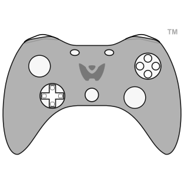

# anti-cheat-socketio
<br/>
<br/>

[](https://npmjs.org/package/anticheat-socketio 'View this project on NPM')
[](https://www.npmjs.com/package/anticheat-socketio)
<p style="font-size: 2vw">above header help from <a href="https://github.com/expressjs/express">here</a>


<br/>
<br/>

<div>

</div>
 Server-side anti-cheat library for socketIO games

<br/>
<br/>

# History
    Created by Stark for the game studio he created

<br/>
<br/>
<br/>

# Made For  : 

    SocketIO library "npm i socketio"
    https://www.npmjs.com/package/socketio

<br/>
<br/>
<br/>

# Getting Started : 

 Install package : 

    npm i anticheat-socketio

<br/>
<br/>
<br/>

# Usage : 

```js
const anti_cheat = require('anticheat-socketio')

io.on('connect', function(socket){

    anti_cheat.connect_socket_anticheat(socket);

    var inital_integrity_package = anti_cheat.init_anticheat_join_package(socket);
    socket.join('anticheat')

    socket.emit("init_antiC", inital_integrity_package);

    socket.on("move_event", function(data){

        is_valid_move = anti_cheat.is_move_event_ok(data);
        if(!is_valid_move){
            return;
        };

    })

    socket.on("collect_item_event", function(data){

        is_valid_collect_item = anti_cheat.is_item_ok(data);
        if(!is_valid_move){
            return;
        };
        
    })

})


io.on('disconnected', function (socket) {
    anti_cheat.disconnect_socket_anticheat(socket);
})
```

<br/>
<br/>
<br/>


# Overall Goals : 

    - Efficient event-driven integrity events with minimum latency
    
    - pass in game config to configure acceptible game mechanics

    - configure overall settings (ex. max # of concurrent connections, time delays and more)

# Features :

    🔳 Time between requests
    ✅ # of concurrent connections (socket Vs. address)
    🔳 move algorithms :
        ✅ Linear slope
        🔳 new x vs. last x
        🔳 new y vs. last y
        🔳 new z vs. last z
    🔳 items check : 
        ✅ is_item_ok
        🔳 Is item value ok


<br/>
<br/>
<br/>

# To Detect Goals : 
 - number of concurrent connections
 - initial join package
 - events, movement, items and IO package anomalies
 - more arriving soon

<br/>
<br/>
<br/>

# Naming Convention : 
snake_case (yes for all aspects front-end, back-end, packages)

Reasons why : 

1) Readability

2) reduced context-shifting and mental strain


Why? see <a href="https://stackoverflow.com/questions/21503430/snake-case-or-camelcase-in-node-jshttps://www.cs.kent.edu/~jmaletic/papers/ICPC2010-CamelCaseUnderScoreClouds.pdf">here</a>, <a href="https://stackoverflow.com/questions/33094418/why-use-camel-case-for-js-and-snake-case-for-your-db">here</a> , and <a href="https://www.cs.kent.edu/~jmaletic/papers/ICPC2010-CamelCaseUnderScoreClouds.pdf">here</a>


Sources : 
<a href="https://expressjs.com/en/5x/api.html">express template</a>